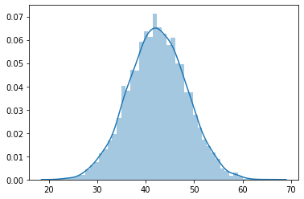
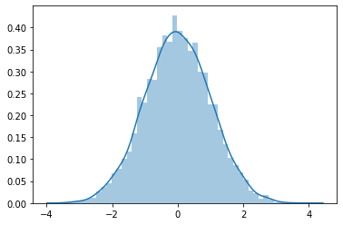

# The Standard Normal Distribution - Lab

## Introduction

In the previous lesson, you learned about the formula of the $z$-score, and looked at a few toy examples to explain an observation's standard score for normally distributed data. In this lab, you'll practice by standardizing and visualize some normal distributions.

## Objectives

You will be able to:

* Calculate and interpret the z-score (standard score) for an observation from normally distributed data
* Visualize data before and after standardization to visually inspect the results

## Let's get started

> A $z$-score can help identify how many standard deviations above or below the mean a certain observation is. Every time you obtain a $z$-score, use “above” or “below” in your phrasing.

The yields of apple trees in an orchard have been recorded in the file `yield.csv`. Each observation is recorded by weighing apples from trees (in pounds) and adding their weights. There are 5000 observations in total for this data. 

## Load, visualize and give general comments about the dataset

Use pandas for loading and inspecting the data.


```python
# Import libraries
import pandas as pd
import numpy as np
import seaborn as sns
import matplotlib.pyplot as plt
%matplotlib inline

# Read the yield data as a dataframe
df = pd.read_csv('yield.csv')
df.head()
```


<div>
<style scoped>
    .dataframe tbody tr th:only-of-type {
        vertical-align: middle;
    }

    .dataframe tbody tr th {
        vertical-align: top;
    }

    .dataframe thead th {
        text-align: right;
    }
</style>
<table border="1" class="dataframe">
  <thead>
    <tr style="text-align: right;">
      <th></th>
      <th>0</th>
    </tr>
  </thead>
  <tbody>
    <tr>
      <td>0</td>
      <td>39.741234</td>
    </tr>
    <tr>
      <td>1</td>
      <td>39.872055</td>
    </tr>
    <tr>
      <td>2</td>
      <td>44.331164</td>
    </tr>
    <tr>
      <td>3</td>
      <td>46.600623</td>
    </tr>
    <tr>
      <td>4</td>
      <td>40.694984</td>
    </tr>
  </tbody>
</table>
</div>


```python
df.describe()
```


<div>
<style scoped>
    .dataframe tbody tr th:only-of-type {
        vertical-align: middle;
    }

    .dataframe tbody tr th {
        vertical-align: top;
    }

    .dataframe thead th {
        text-align: right;
    }
</style>
<table border="1" class="dataframe">
  <thead>
    <tr style="text-align: right;">
      <th></th>
      <th>0</th>
    </tr>
  </thead>
  <tbody>
    <tr>
      <td>count</td>
      <td>5000.000000</td>
    </tr>
    <tr>
      <td>mean</td>
      <td>42.407624</td>
    </tr>
    <tr>
      <td>std</td>
      <td>6.003697</td>
    </tr>
    <tr>
      <td>min</td>
      <td>21.931212</td>
    </tr>
    <tr>
      <td>25%</td>
      <td>38.371895</td>
    </tr>
    <tr>
      <td>50%</td>
      <td>42.352304</td>
    </tr>
    <tr>
      <td>75%</td>
      <td>46.458478</td>
    </tr>
    <tr>
      <td>max</td>
      <td>65.548170</td>
    </tr>
  </tbody>
</table>
</div>


```python
# Create a plot

sns.distplot(df)
```


    <matplotlib.axes._subplots.AxesSubplot at 0x1a1b692780>





Your comments about the data here
Normal distribution with some outliers and the mean is not centered around 0

## Briefly explain what each value represents in this data set

Each observation is recorded by weighing apples from trees (in pounds) and adding their weights. 

Each observation could be the weights of apples collected per tree. Some trees produce more apples than others, some trees might produce bigger/heavier apples...

## Define the interval bounds which contain 99% of the observations   

> **Hint**: Recall the empirical rule related to $3\sigma$.


```python
# Perform any calculations necessary here
mu = 42.407624 
sigma = 6.003697

print("Mean:", mu)
print("SD: ", sigma)
```

    Mean: 42.407624
    SD:  6.003697


```python
SDpos1 = round((mu + sigma),2)
SDneg1 = round((mu - sigma),2)

print(f"68% of trees yield between {SDneg1} and {SDpos1} pounds of apples.")


SDpos2 = round((mu + 2*sigma),2)
SDneg2 = round((mu - 2*sigma),2)

print(f"95% of trees yield between {SDneg2} and {SDpos2} pounds of apples.")


SDpos3 = round((mu + 3*sigma),2)
SDneg3 = round((mu - 3*sigma),2)

print(f"99% of trees yield between {SDneg3} and {SDpos3} pounds of apples.")
```

    68% of trees yield between 36.4 and 48.41 pounds of apples.
    95% of trees yield between 30.4 and 54.42 pounds of apples.
    99% of trees yield between 24.4 and 60.42 pounds of apples.


## Compute and interpret the z-score for a tree yielding 35 pounds of apples


```python
# Calculate z

# z = (x - mu) / sigma

z = (35 - mu) / sigma
z
```


    -1.2338437466114627


Interpret the result
* a tree yielding 35 pounds of apples is 1.23 standard deviations below the mean.

## Suppose a tree has a z-score of 1.85. Interpret this z-score. What is the yield of this tree?


```python
# Interpret the z score
x = mu + 1.85*sigma
```


```python
# Calculate yield
x
```


    53.51446345


```python
# What is the yield ?

# 53.51 lbs
```

##  Convert each tree’s yield to a z-score so the new variable is the “z-score for weight”

The units are still the apple trees. For the data set of all z-scores:

* What is the shape? 
* The mean? 
* The standard deviation?


```python
# Give your solution here 
df.rename(columns={'0': "pounds"}, errors="raise", inplace=True)
df.head()
```


<div>
<style scoped>
    .dataframe tbody tr th:only-of-type {
        vertical-align: middle;
    }

    .dataframe tbody tr th {
        vertical-align: top;
    }

    .dataframe thead th {
        text-align: right;
    }
</style>
<table border="1" class="dataframe">
  <thead>
    <tr style="text-align: right;">
      <th></th>
      <th>pounds</th>
    </tr>
  </thead>
  <tbody>
    <tr>
      <td>0</td>
      <td>39.741234</td>
    </tr>
    <tr>
      <td>1</td>
      <td>39.872055</td>
    </tr>
    <tr>
      <td>2</td>
      <td>44.331164</td>
    </tr>
    <tr>
      <td>3</td>
      <td>46.600623</td>
    </tr>
    <tr>
      <td>4</td>
      <td>40.694984</td>
    </tr>
  </tbody>
</table>
</div>


```python
z_apples = [(x - df.pounds.mean())/df.pounds.std() for x in df.pounds]
```


```python
sns.distplot(z_apples)
```

    MEAN:  0.0
    SD:  1.0





```python
mean = np.mean(np.array(z_apples))
std = np.std(np.array(z_apples))

print("MEAN: ", round(mean,2))
print("SD: ", round(std,2))
```

    MEAN:  0.0
    SD:  1.0


## Summary

In this lab, you practiced your knowledge of the standard normal distribution!
